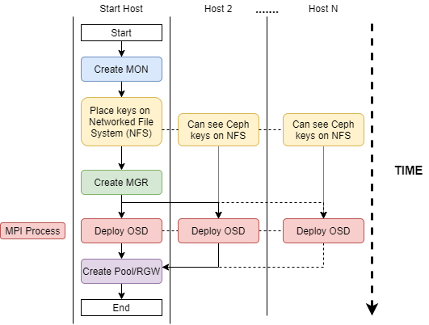
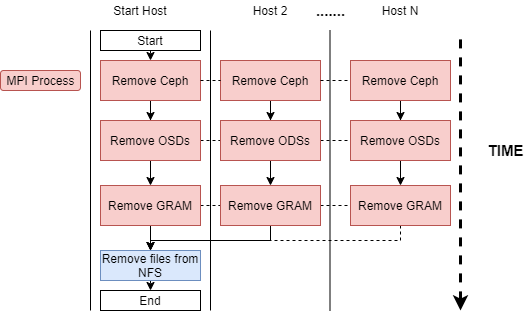

# DisTRaC - Distributed Transient Ram Ceph

[](https://doi.org/10.5281/zenodo.4013776)

| Version | 1.1.0                                         |
|---------|-----------------------------------------------|
| Date    | 2020-09-07                                    |
| Authors | Gabryel Mason-Williams - Diamond Light Source |
| Authors | Dave Bond - Diamond Light Source              |
| Authors | Mark Basham - Rosalind Franklin Institute and  Diamond Light Source              |


DisTRaC is a deployment tool that allows Ceph to run on a High-Performance Computing cluster using RAM when a Network File System is present. It's designed to be used with a job scheduler such as Univa Grid Engine (UGE) to create a transient object store as and when required which lasts as long as the user intends.

## System Requirements:
- Ceph version 12+ (Tested on Luminous and Nautilus) 
- OpenMPI 
- A job scheduler if using UGE, then a parallel environment (PE) is also required, more details below.
- Network File System
- Sudo privileges  
- RHEL/CENTOS 
- GRAM (The module this comes with is for the 3.10 kernel) The repo and source code is here https://github.com/DiamondLightSource/GRAM

### Running with UGE

To run with UGE, a PE is required. The PE needs to ensure that slots are spread across multiple hosts. The easiest way to set this is so only one slot is allocated per host. This ensures that when asking for six slots, six hosts are also allocated—creating a situation where `qsub -pe ceph 6`  would allocate six nodes with one slot on each. When running an application with DisTRaC more complex PE's may be required to make sure resources are appropriately allocated.  A simple example is if an application requires 15 slots to run correctly, then a PE will need to allocate 16 slots per host, allowing a slot for Ceph to run. In this situation, this command `qsub -pe ceph-application 48` would allocate three nodes with 16 slots on each.  

## Background to Ceph 

If you have not used Ceph before or are unsure of the terms used here, an intro to ceph with the docs can be found here: https://ceph.readthedocs.io/en/latest/start/intro/

## How It Works

DisTRaC creates a ceph instance that runs using RAM. As the system is volatile, only one MON and MGR is created, and the replication of storage pools set to one.

### Deployment



### Removal


## How To Use

**Note: This was designed to be run at Diamond, meaning changes may be required to run properly within another system.**

DisTRaC takes several parameters to run:
``` 
./distrac.sh
 -i=  | --interface= Network interface to use, i.e. -i=ib0 or --interface=ib0 (Required)
 -s=  | --size=      Size of RAM to use, i.e. -s=50GB or --size=100GB (Required)
 -n=  | --number=    Number of RAM OSDs on each host, if -s=50GB and -n=5 that will create 5 OSDs using 250GB of RAM (Required)
 -f=  | --folder=    Folder to locate Ceph keys this allows for multiple deployments when different folders speficed.
 -hf= | --hostfile=  When not using UGE with a parallel environment, provide a file with a list of comma separated hosts
 -pn= | --poolname=  Define the name of a pool if using RADOS, i.e. -pn=example or --poolname=example 
 -rgw | --rgw        To use a rados gateway set the flag set on i.e. -rgw or --rgw
 -uid=| --uid=       To create an s3 user for the rados gateway i.e.  -uid=test or --uid=test
 -sk= | --secretkey= This will create an acess and secret key for the user define in -uid, i.e. -sk=test or --secretkey=test
 -h   | --help       Display help message
```

Removal only requires a folder and hostfile is they where specified when running DisTRaC otherwise `./remove-distrac.sh` will suffice. 

```
./remove-distrac.sh -h

 -f=  | --folder=    Folder with Ceph keys to remove
 -hf= | --hostfile=  When not using UGE with a parallel environment, provide a file with a list of comma separated hosts for Ceph removal.
 -h   | --help       Display help message

```

### Basic Ceph instance

To create a basic ceph instance using DisTRaC all that needs to be set is the network interface for communication, the size of the RAM OSD and the number of OSDs on each host. 

```
 ./distrac.sh -i=ib0 -n=1 -s=80G
```

This will create a ceph instance with the public and cluster network communicating over the ib0 interface. Each host will have one OSD of size 80G. 

### Ceph instance with a storage pool

To create a ceph instance with a storage pool, an additional parameter is needed. `-pn=` creates a pool with the name chosen and automatically sets the placement groups required based on the amount of OSD's and total hosts. 


```
./distrac.sh -i=ib0 -n=1 -s=80G pn=example
```
This creates a pool called example with 512 pg groups. 

### Ceph instance with a rados gateway and s3

To create a ceph instance with a rados gateway, three additional parameters need to be set the rgw flag, uid and secret key  `-rgw` `-uid` and `-sk` respectively. 

```
./distrac.sh -i=ib0 -n=1 -s=80G -rgw -uid=example -sk=example
```

This creates a ceph instance that has rados gateway and an s3 user with the id of example and a secret and access key of example.  


### Multiple instances of ceph at once

To create multiple instances of Ceph, then the folder flag needs to be set `-f` or `--folder`. DisTRaC by default stores the Ceph keys inside the DisTRaC folder. This means sending two or more deployments to the job schedular could potentially interact with each other keys. To get around this problem, specify a folder name this will be created inside the distrac folder allowing for multiple instances to run without interacting.

`./distrac.sh -i=ib0 -n=1 -s=80G -pn=example -folder=run1`

`./distrac.sh -i=ib0 -n=1 -s=80G -rgw -uid=example -sk=example -folder=run2`

### Using another job scheduler
By supplying a host file as a parameter, any job scheduler can be used as long a list hosts the job will run on can be extracted. A host file should have a list of hosts separated by commas i.e.

`cat /home/user/hostfile`
```
node1,node2,node3,node4
```

Example using hostfile:

 `./distrac.sh -i=ib0 -s=100G -n=1 --hostfile=/home/user/hostfile` 

How to generate the host file within the job scheduler is left to the user, distrac/uge-hostfile.sh demonstrates how it is generated when using UGE. 


### Removing Ceph

To remove Ceph from the system run `./remove-distrac.sh`. If a folder or hostfile was used in the creation of ceph specify as required.  

## Example of creating a Distributed Transient RAM Ceph

**Note: This example is based on Diamond's system using UGE with a PE called ceph.**

To create a transient Ceph instance, the deployment and removal of ceph needs to be wrapped with an application running in the middle. An example as follows
```sh 
#!/usr/bin/env bash
echo "Start"
cd distrac
./distrac.sh -i=ib0 -s=60G -n=1 -pn=example
# USER JOB
ceph -s 
# END OF USER JOB
./remove-distrac.sh
cd ..
echo "Done"
```
Here a ceph instance will be deployed then  `ceph -s` will be run afterwards ceph will be removed from the hosts it's running on. 

Submitting using UGE `qsub -pe ceph 10 -q high.q ./example-run.sh` the output from the user's job would be if the head node is `node5`:

```
.
.
  cluster:
    id:     048a0be6-614a-4e1d-8d1e-97004fb40593
    health: HEALTH_OK

  services:
    mon: 1 daemons, quorum node5
    mgr: node5 (active)
    osd: 10 osds: 10 up, 10 in

  data:
    pools:   1 pools, 1024 pgs
    objects: 0 objects, 0B
    usage:   10.0GiB used, 590GiB / 600GiB avail
    pgs:     1024 active+clean
.
.
```

More examples can be found in the folder examples. To use the code in the examples folder, run it from inside the examples folder.

## Questions

Any questions, please contact scicomp@diamond.ac.uk. 
